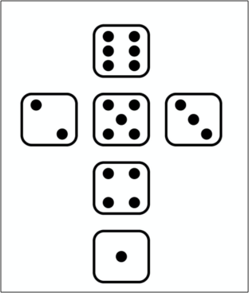
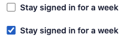

## Завдання 1: Намалювати фігуру

Вимоги:

-   Не використовувати картинок
-   html/css (flexbox)
-   Точки центрувати з допомогою flexbox
-   Адаптивний дизайн не потрібний

По бажанню:

-   Адаптивний дизайн (кубіки ставали меншими відповідно до розміру сторінки “щоб скрол внизу сторінки не появлявся”)
     
     

## Завдання 2: Зробити форму логіну (тільки дизайн)

Вимоги:

-   Не використовувати зображень
-   Форма повинна бути відцентрована посередині сторінки
-   Коли ти наводиш на поле вводу, checkbox, кнопку, чи силки (“forgot your password?”, “Use single-on...”, “Sign up”) повинен показувати палець (cursor: pointer)
-   “Forgot your password” - силка яка веде на google.com
-   “Use single-on…” - силка яка веде на google maps
-   “Sign up” - силка яка веде на facebook
-   Таким повинна бути галочка якщо її вибрати

-   Шрифти на вибір
-   Кольори повинні бути приблизно схожі
-   Розміри відносно екрану приблизно

По бажанню:

-   Адаптивний дизайн
-   Js - валідацію полів (email - дійсно email, password - мінімум 6 символів)
-   React - можете це на реакті зробити
